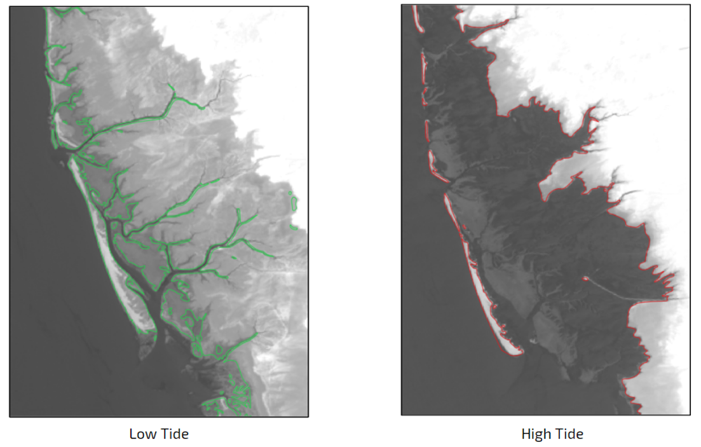
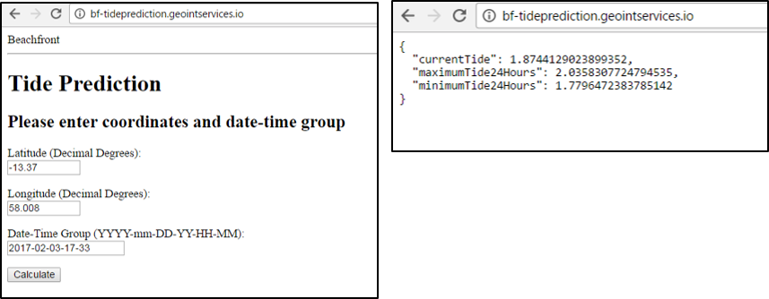
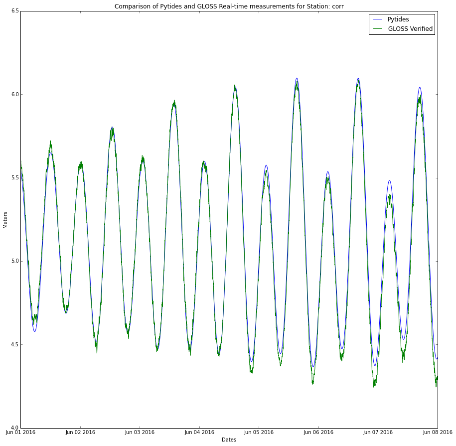
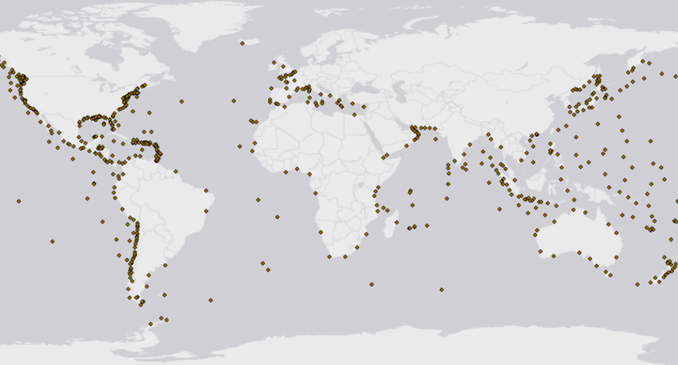
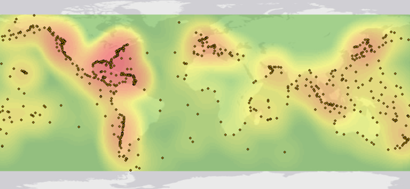

#Description#

Bf-tideprediction is a Beachfront service that estimates the tide level for a given date/time as well as the 24 hour min/max tides and corresponding times surrounding that date/time.  This service is used by Beachfront to provide contextual information to be used in conjunction with Beachfront’s shoreline extraction services.

##Why are tides important for shoreline extraction?##


##Why create a new tide service instead of using a third-party service?
* Limited API access
* Most services offer either historic tide data or predict future tides, but don’t offer both
* Cost. Best services require user subscriptions
* Query locations visible to 3rd party
* Inability to migrate to classified environment
* Reliance on 3rd party server availability


#Operation#
Bf-tideprediction works in both individual and batch modes.  

##Individual Query mode:##

###API###
The individual mode has an api endpoint of https://bf-tideprediction.geointservices.io and accepts the following keys:

| Keys | Description
------|-------------------
| lat | decimal degrees between -90 and 90	
| lon | decimal degrees between -180 and 180
| dtg | Date/Time in format : YYYY-MM-DD-HH-MM (Universal Standard Time)

Sample Query:
~~~
 curl -X POST -d 'lat=-33.85&lon=151&dtg=2016-05-31-0-1' "https://bf-tideprediction.geointservices.io/"
~~~

###Web Interface###
The individual query mode also has a web-based form.  Enter coordinates in decimal degrees, and provide the data and time in the format YYY-mm-DD-HH-M in UST.  Select “Calculate” and the results will be returned in the browser as a json file.



##Batch Queries##


TidePrediction.stage.geointservices.io json collections in the format:


```json
{
  "locations": [
    {
      "dtg": "some_dtg1",
      "lat": "some_lat1",
      "lon": "some_lon1"
    },
    {
      "dtg": "some_dtg2",
      "lat": "some_lat2",
      "lon": "some_lon2"
    }
  ]
}
```


Sample Query:
~~~
curl -X POST -H "Content-Type: application/json"  -d '
{"locations": [{"lat": 73.63008647322661, "lon": -81.5557487110026, "dtg": "2015-12-20-09-36"}]}' "https://tideprediction.stage.geointservices.io/tides"
~~~

#Algorithm#


Beachfront’s Tide Prediction service utilizes the python library Pytides to predict past and future tides.  These predictions are based upon harmonic constituents estimated from historical sea level buoy data. The service accepts a latitude/longitude pair and a date time group and returns the current tide level at that time, as well as the minimum and maximum of the 24 hour period following the time.  According to their documentation, Pytide's tidal prediction is based upon several fundamental assumptions.  The first assumption is that tides anywhere on Earth are caused solely by the gravitational forces of the moon and the sun. Pytides neglects the gravitational forces of other planetary bodies as their effect on the tide is several orders of magnitude weaker than those of the moon and sun.  The second assumption is that for any given location on Earth, there exist constant values such that the tide there obeys this relation.  So if we have many past measurements of the tide at a given location, we can attempt to choose values  which best fit our previous readings.Then, by assumption, we can predict the future tide by allowing t to increase into the future.




Beachfront's Tide Prediction service obtains these historic measurements by querying the GLOSS buoy network.  The service takes latitude and longitude coordinates, as well as a date-time group (DTG).  A lookup table hosted by bf-tideprediction calculates the station id for the appropriate sea level monitoring stations.  Utilizing a locally stored database of historic sea level data, constituents are calculated for each appropriate station.  The tides are then predicted for those stations, for a 24 hour  period surrounding the image DTG on a minute by minute basis.  These data points are interpolated to provide sea level height for the image date-time group, and a minimum and maximum tide height for a given time period.  


######Gloss Buoy Locations #######



######Density Map of Gloss Buoy Locations #######


A lookup table hosted by bf-tideprediction calculates the station id for the appropriate sea level monitoring stations by querying the coordinates against a pre-computed set of voronoi polygons.  In mathematics, a Voronoi diagram is a partitioning of a plane into regions based on distance to points in a specific subset of the plane.  For each initial point (or seed) there is a corresponding polygon consisting of all points closer to that seed than to any other. These regions are called Voronoi cells.  For the Beachfront Tide Prediction service, a one-time calculation of Voronoi polygons was generated for the Gloss Buoy data.  For a given coordinate, the corresponding known point is queried  This is simpler than triangulating between the points of a Delaunay triangle, but may be less accurate as its based on a single known point.


######Source (https://commons.wikimedia.org/wiki/File:Euclidean_Voronoi_diagram.svg)######